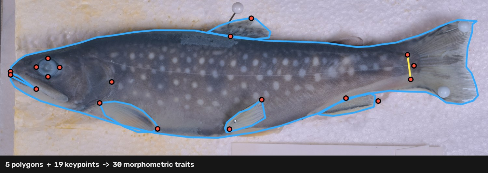

# caliPr

**Reproducible morphometrics for fish collections.**

Body shape carries a great deal of fish biology: how populations diverge after
isolation, how taxonomic relationships resolve in morphologically cryptic groups,
how hatchery strains differ from one another, how a species partitions its
habitat. Getting shape *out* of specimens is the bottleneck. A morphometric
study still means opening photographs one at a time and clicking landmarks by
hand, and the numbers that come out carry no record of how they were produced —
which landmarks, placed by whom, at what scale, on which photograph.

caliPr turns a folder of specimen photographs into three things a study can
actually use:

- **a validated workbook** of 33 morphometric traits, size-corrected and unit-safe;
- **landmark coordinates in TPS format**, ready for Procrustes analysis in
  geomorph without touching `digitize2d`;
- **the annotations themselves** as plain JSON, which outlive every export
  derived from them.

Built at the Cornell University Museum of Vertebrates, and validated against
physical caliper measurements at **1.12% median agreement** on standard length.
Collaborators without Python can label in a single self-contained HTML file and
send work back in a form the pipeline verifies before it accepts.



## Why

The reference implementation for photographic fish morphometrics is
[MorFishJ](https://github.com/mattiaghilardi/MorFishJ), an ImageJ plugin that
defines a careful, well-documented trait schema. Its limitation is the one every
click-based tool has: the measurement and the record of the measurement are the
same act. Re-measuring means re-clicking, a changed trait definition means
re-doing the study, and nothing downstream can tell a confident number from a
mistaken one.

caliPr separates the two. Landmarks are recorded once as coordinates; every trait,
ratio, shape variable and figure is *derived* from them. Changing a trait
definition is a re-run rather than a re-digitization, a second study can ask
different questions of the same annotations, and the same coordinates that
produce the spreadsheet also train a model to place them automatically.

It implements the full MorFishJ trait set so results stay comparable to work done
in that plugin, and adds the traits the Cornell collection needed.

## What it produces

### A measurement workbook

One `.xlsx` per dataset, six sheets. The extra sheets are not decoration — each
answers a question that otherwise gets answered wrong in a spreadsheet three
months later.

| sheet | what it is for |
|---|---|
| **About** | What this file is, when and from which commit it was generated, how many specimens are in millimetres versus pixels, how many checks failed, and which traits were out of scope. Written so the file explains itself to someone who did not run it. |
| **Measurements** | One row per specimen, one column per trait, plus a per-row `units` column. |
| **Ratios** | Each length over standard length, each area over SL². Dimensionless — but it assumes shape does not change with size. |
| **Shape** | Mosimann log-shape variables: each length over the geometric mean of all lengths, logged. This is the defensible size correction for comparing groups that differ in body size, and the sheet a population comparison should actually use. |
| **QC** | Calibration method and confidence per view, missing landmarks, recorded data compromises. |
| **Validation** | Every automated check, most severe first. |

A study that does not collect a landmark gets **no column for the traits that
needed it**, rather than a column of blanks — an empty column reads as "measured
and missing" when the truth is "never in scope".

### Landmark coordinates for geometric morphometrics

`export_tps.py` writes the `.tps` that `readland.tps` reads, so `digitize2d`
never has to run. Two details in that format corrupt data silently and are
handled explicitly: TPS y is Cartesian from the **bottom** left (writing image y
unflipped mirrors every specimen, and Procrustes will happily align mirrored
shapes), and TPS has no NA — the convention is a negative coordinate read back
with `negNA = TRUE`, where writing a `0` would pin a landmark to the image corner
and drag the whole fit.

TPS identifies landmarks by row order, never by name, so the export ships a
`landmark_names.csv` and an R snippet that attaches them to the array's
dimnames. The order comes from the schema, which is the same order the
measurement engine and the pose model use.

```r
library(geomorph)
A <- readland.tps("landmarks.tps", specID = "ID", negNA = TRUE)
dimnames(A)[[1]] <- read.csv("landmark_names.csv")$name
gpa <- gpagen(A)              # Procrustes: strips size, position, rotation
plot(gm.prcomp(gpa$coords))   # shape space
```

Linear traits and Procrustes shape come from the same annotation, so the two
analyses cannot disagree about where a landmark was.

### The annotations, and pictures of them

Annotations live as one plain JSON sidecar per specimen, keyed by landmark name.
They are the durable artefact — every export is derived from them, they diff
legibly, and they are small enough to keep in version control beside the code
that reads them. `render_overlays.py` draws each annotation back onto its
photograph, which is what a supervisor, a lab notebook or a figure wants and what
a `.tps` can never be.

## Accuracy and validation

### Agreement with calipers

Across 35 hand-labelled specimens spanning three hatchery strains, standard
length agrees with physical caliper measurements to a **median 1.12%** (mean
1.39%) with a **+0.69% bias** — random scatter rather than a measurement offset.

The specimen-to-caliper mapping was itself verified rather than assumed: an
offset sweep confirms ASN and HRN align at offset 0 (1.40% / 1.56% mean error,
versus 12–20% at any shift). Seven TXD rows disagree with their photographs by
5–32% with mixed sign, and no offset explains it; those measurements check out
independently (SL expressed in *ruler spans*, which needs no millimetre
assumption and no choice of posterior endpoint), so the spreadsheet rows are the
suspect party. They are listed in `data/validation/caliper_exclusions.json` and
excluded from validation only — still valid for measurement and for training.

### Scale calibration

Three routes, all producing px/mm or declaring that they cannot:

1. **Ruler auto-scale (preferred).** `detect_tick_scale()` measures the
   millimetre ticks directly — no clicks, no typed span. Validated against 20
   hand-clicked calibrations across two camera distances: **mean error 1.0%, max
   2.5%, 20/20 within 3%.**

   The trap it avoids: C-Thru rulers carry *both* metric and imperial scales, and
   1/16 in = 1.5875 mm, so the imperial ticks appear as a period ~1.59× coarser.
   Taking the strongest autocorrelation peak picks those and inflates every trait
   by ~59%. The millimetre ticks are the *finest* true periodicity, so the
   detector takes the smallest period several frequency bands agree on.

   Detection is not accuracy. The detector finds a ruler in 180 of 181 alewife
   photographs, but only 9 of those 27 collection lots are internally consistent
   to within 25% — so the per-lot check below is what makes those scales usable,
   not the hit rate.
2. **Two clicked points and a known span.** The fallback. A mistyped span is the
   one calibration error nothing downstream can catch, because the wrong scale is
   perfectly self-consistent. The labeler shows a live px/mm readout and warns
   when a specimen drifts from its **collection lot's** median; comparing against
   a whole-batch median instead flags healthy specimens, because camera distance
   genuinely varies between lots.
3. **No scale at all.** A legitimate mode, not a failure — a study asking about
   *proportions* does not need millimetres. Those specimens measure in pixels,
   the workbook says so in a per-row `units` column, and the Ratios and Shape
   sheets stay valid because both are dimensionless. What the pipeline refuses to
   do is put pixels and millimetres in one column without saying which is which.

### Automated checks before export

Eight checks run before the workbook is written. Each exists because its failure
mode is **silent** — none of them throw, and none of them look wrong once the
number is in a cell.

| check | the silent failure it catches |
|---|---|
| `orientation` | A mirrored specimen swaps `Bs` and `CFs` — two plausible numbers in the wrong columns. |
| `landmark_in_frame` | A coordinate outside the image means the sidecar belongs to a different photograph, usually after a re-crop. The geometry stays self-consistent. |
| `duplicate_id` | Two sidecars claiming one `fish_id` collapse to one row. |
| `mixed_units` | Millimetres and pixels under one header. |
| `calibration_outlier` | A mistyped span scales every trait on that specimen. Judged against the collection lot, not the batch. |
| `shape_outlier` | Size-corrected proportions far from peers — usually a misplaced landmark, and far cheaper to catch here than in a scatter plot at the end. |
| `sparse_outline` | A fin outline too coarse for its area to mean anything. |
| `incomplete` | Landmarks never placed. Not an error; labelling in progress looks exactly like this. |

Thresholds are conventional rather than tuned to this data: a robust z of 3.5 on
a median/MAD scale, and 25% calibration drift — wide, because it is hunting a 5×
typo, not a 5% wobble. Across the 60 sidecars in both datasets the pass currently
returns zero errors, five shape-outlier warnings, and the incomplete notes that
labelling in progress necessarily produces. That last figure is a snapshot, not a
guarantee: the checks are there because these failures do happen.

## Studies

|  | brook trout (`cornell`) | alewife (`alewife`) |
|---|---|---|
| species | *Salvelinus fontinalis* | *Alosa pseudoharengus* |
| question | body-shape differences among three hatchery strains | proportional differences between landlocked Great Lakes and migratory populations |
| photographs | 131 | 181, across 27 collection lots, 1932–1987 |
| labelled | 46 lateral, 35 frontal | 5 |
| collects | 5 polygons, 19 keypoints | 3 polygons, 23 keypoints |
| scale reference | C-Thru ruler on the tray | ruler on the tank glass |

The alewife study runs for BIOEE 4761 (Ichthyology, Cornell). Population
assignment for its 27 lots is not yet made, and no comparison is meaningful until
it is — see [Development status](#development-status).

Each study declares its own landmark set, so one engine serves both without
either being able to drift from it. The alewife study excludes the pelvic and
anal fin outlines: on those specimens there is too little fin-to-body contrast
and too much fraying to trace them honestly, so the study drops them rather than
recording guesses.

## Installation

```bash
pip install -e ".[dev]"
```

Python 3.11+ (NumPy ≥1.26, OpenCV ≥4.9, openpyxl ≥3.1, Pillow ≥10). Editable
installs need pip ≥21.3. The DeepLabCut stack used for automated landmarking is
heavy and pinned separately — install it into its own environment rather than
alongside the pipeline.

```bash
python -m pytest        # 134 passed
```

## Usage

```bash
# Label. Opens at http://localhost:8765 with a dropdown for every dataset
# under data/ that has a lateral/ folder.
python scripts/label_server.py

# Measure. Validates, then writes results/<dataset>/measurements.xlsx
python scripts/export_measurements.py --dataset cornell

# Landmarks for geomorph, and a folder of annotated photographs
python scripts/export_tps.py --sidecars data/cornell/sidecars \
    --images data/cornell/lateral --out results/cornell/tps
python scripts/render_overlays.py --dataset cornell
```

All three exports are also buttons in the labeler's sidebar, so a labelling
session never needs a terminal.

A dataset is any folder under `data/` containing a `lateral/`. It may also hold
`frontal/`, a `sidecars/` directory, and a `schema.json` declaring what the study
collects:

```
data/alewife/
  lateral/        photographs (gitignored — large, and the museum's)
  sidecars/       one JSON per specimen (tracked: this is the data)
  schema.json     which landmarks and outlines this study uses
```

`schema.json` can only *remove* from the master schema, never add — anything a
dataset invented would be unknown to the measurement engine, so a typo weakens
the task list instead of silently creating a landmark. Editing it by hand is
optional; the × beside any landmark in the labeler writes it.

Only the CUMV trout rig needs preprocessing, because one photograph there holds
the lateral view, a mirrored head shot and a ruler, and has to be split:

```bash
python scripts/preprocess_jonah.py --raw-dir data/cornell_raw/jonah \
    --out-dir data/cornell --lateral-margin 450
```

### Labelling

`scripts/label_server.py` serves a dependency-free browser labeler that reads the
landmark schema live from `landmark_config.py`, so the UI cannot drift from what
the measurement engine expects. It writes sidecar JSON directly — no CVAT
round-trip, no import step.

Three columns: controls on the left, the landmark task list beside them, the
specimen browser on the right, both dividers draggable. Everything the schema
defines is visible at once — a collapsed list saves pixels and costs a click per
landmark, which is the wrong trade when the click is the whole job.

- **Reference panel** — an annotated real specimen beside the canvas, which zooms
  to whichever landmark is selected, at a magnification chosen from the
  reference's own resolution rather than fixed. Rebuild it from any labelled fish
  with `scripts/make_reference.py --specimen <stem>`. Minimisable, and it comes
  back.
- **Editing** — click an outline to insert a vertex, drag any point to move it,
  `Z` undoes the *selected* landmark. A live ±px readout reports the placement
  precision the current zoom level actually affords.
- **Exclusion** — the × beside a landmark marks it out of scope for the whole
  study. It greys out in the canvas, drops out of the progress count, and its
  dependent traits lose their columns in the export. This is a project-level
  decision, written to the dataset's `schema.json`, not a per-specimen one.
- **Contrast and brightness** sliders for faint fins against shadow — display
  only; they never touch coordinates.
- **Drafts** autosave to the browser and survive reload; **Save sidecar** writes
  the file the pipeline reads. A draft older than its sidecar on disk is
  discarded, so an edit made outside the browser cannot be silently overwritten
  by a stale draft.
- **Specimen search** — `/` focuses it. Ids match as substrings, so `TXD_4`
  finds `TXD_4` and `TXD_40`–`49`; status words match whole-word, so `todo`,
  `labelled`, `heldout` and `fins` filter by state. Terms are ANDed
  (`todo txd` = unlabelled TXD only), Enter opens the top hit, Escape clears.
- **Fin retrace mode** walks one fin at a time — base, tip, outline — framed and
  zoomed, hiding every other landmark so the specimen is actually visible (hold
  `H` to reveal them). The specimen list becomes a worklist of fish whose fin
  outlines are not yet dense enough to trust an area from.

The labeler and its reference assets are in the repository, but **the
photographs are not** — they are large, and they are the museum's. A fresh clone
opens to an empty specimen list until images exist under
`data/<dataset>/lateral/`; the server says so on startup. The sidecars *are*
tracked, so the annotations and everything computed from them travel with the
repo.

### Labelling without installing anything

`scripts/build_standalone_labeler.py` emits a single ~24 KB HTML file with the
schema, the reference imagery and the whole editor inlined. It runs from a
double-click, needs no Python, no server and no network. It collects landmarks
only — no outlines, no ruler — which is what geomorph needs and what makes the
task explainable in two sentences.

It exports in two shapes:

- **Bundle (`.zip`)** — `labels.json` plus every photograph, **byte for byte as
  the labeller opened them**. This is the one that lets a contributor supply
  their own specimens: coordinates without their pixels train nothing.
- **Labels only (`.json`)** — coordinates alone. Correct only for someone who
  already holds the identical photographs.

Bundles are smaller than they sound. Measured on the two datasets here:

| | per photograph | bundle of 40 | whole dataset |
|---|---|---|---|
| trout (4237×4000) | 3.1 MB | 123 MB | 0.45 GB (131) |
| alewife (6000×4000) | 2.1 MB | 84 MB | 0.34 GB (181) |

A classmate's 40-specimen bundle is under 150 MB either way — a Drive or
WeTransfer link, not an email attachment, and no reason to compromise on
sending the originals. Downscaling to the 0.25 the model actually trains at
would cut a 40-fish bundle to 8–11 MB, which is not worth giving up the
full-resolution copy: those same pixels are what a millimetre measurement and
any future re-labelling need. The labeler shows the size and asks before
building anything over a few hundred megabytes, and refuses past 3.5 GB, where
the zip format would need ZIP64.

```bash
python scripts/build_standalone_labeler.py --out caliPr-labeler.html --theme light

python scripts/import_standalone_labels.py --labels ~/Downloads/calipr_bundle.zip \
    --images data/alewife/lateral --out data/alewife/sidecars \
    --annotator "R. Chen" --prefix rchen
```

### Verifying a contributor's labels

A landmark set is valid for exactly the pixels it was drawn on, and the likely
accident is not a misplaced click but a **resized photograph** — a phone
download, a Preview re-export, a mail client shrinking an attachment. That scales
every coordinate by a constant factor, and the result still lands inside the
frame and still looks like a plausible fish. Training on it teaches the model a
systematically displaced anatomy.

So the labeler records each photograph's byte count and a content hash
(SHA-256, or FNV-1a where the browser withholds SubtleCrypto from a `file://`
page), and the import recomputes both from the copy here. It refuses, rather
than warns, on:

| | |
|---|---|
| different dimensions | reports the exact scale factor the coordinates are off by |
| same size, different bytes | the photograph was re-encoded after labelling |
| no photograph at all | ask for the bundle export, not labels-only |
| a bundled photo colliding with a different file already here | `--prefix` namespaces a contributor |
| a sidecar that already exists | `--overwrite` to replace |

A hash match is proof the two files are the same bytes; matching dimensions
alone is not, because a re-encode at the same size changes every pixel and
neither the dimensions nor the file length need move.

The build stamps the schema version and the git commit it came from into the
HTML, and every sidecar records who labelled it — between-annotator differences
are a real effect and cannot be checked for after the fact without that.

## Measurement schema

22 traits from the MorFishJ schema (SL, MBd, Hl, Ed, CPd, PFl, …) plus 11 Cornell
extras, derived from 5 polygons and 23 lateral keypoints.

The lab's own spreadsheet is the requirements list, and the pipeline covers
**every one of its 22 photo-measurable columns**. Three of its columns are
deliberately out of scope: `weight(g)` is a mass, and `body_width` /
`caudal_peduncle_width` are dimensions measured *across* the fish, which a
lateral photograph cannot show. (That is also why those two columns cannot be
used to validate body depth or peduncle depth — they measure a perpendicular
axis.) `tests/test_landmark_config.py` pins the coverage so a column cannot be
dropped silently.

## Limitations

### The fin traits record preservation state as much as morphology

Two separate things degrade the fin traits, and they need untangling.

**Tracing density.** A sparse outline is *imprecise*, and — this took a direct
test to establish — not biased in a predictable direction. The body outline is
traced with ~52 vertices and the fins were originally traced with 7–9, which is
not enough. Subsampling the body outline (dense enough to be its own ground
truth) down to k of its own real vertices loses area monotonically:

| vertices kept | 5 | 7 | 9 | 12 | 16 | 24 |
|---|---|---|---|---|---|---|
| area error | −26% | −13% | −9% | −9% | −5% | −2% |

That measures *subsampling an accurate dense trace*, though, which is not what a
human does with 7 clicks — they place a few points and interpolate by eye, which
can run generous as easily as tight. Re-tracing one fish (HRN_5) at 46–86
vertices per fin and comparing against its own 7–11-vertex original:

| fin | old → new vertices | area change |
|---|---|---|
| anal | 7 → 55 | **+27.1%** |
| pelvic | 10 → 86 | +1.3% |
| pectoral | 11 → 46 | −3.1% |
| dorsal | 10 → 62 | **−7.8%** |

So the sign varies. `FIN_POLYGON_TARGET_VERTICES` is 16 because errors of that
size in *either* direction cannot be corrected after the fact, not because sparse
tracing reads low. The labeler shows a live `n/16` counter per fin and the
pipeline stamps a `data_note` on any specimen below it.

(An earlier version of this section cited a positive correlation between vertex
count and size-corrected fin area as evidence of a density bias. That is
confounded: click count also tracks fin *size* — r = +0.49 dorsal, +0.43 pelvic —
so a bigger fin gets both more clicks and more area without any bias at all.)

**Preservation.** The larger term, and the one no amount of tracing precision
fixes. Restricting to fins already traced at ≥8 vertices, size-corrected
variability is still 60.1% for dorsal fin area and 42.7% for pelvic, against
**5.4% for body area** on the same photographs and the same tracing. Alcohol
preservation dries the fins to where they cannot splay without fraying, so how
far a fin extends depends largely on how that specimen dried and was pinned.

Seven traits are affected (DFh, AFh, PlFl, DFs, PlFs, AFs, and to a lesser extent
PFs). They are still computed, but they record preservation state as much as
morphology, and should not carry a between-group comparison on their own. Some of
the spread is genuine between-fish variation in fin size, which this data cannot
fully separate.

### Declared data compromises

A clipped fin or snout must not silently produce a wrong number. Flagging a
compromise in the labeler records a `data_note` plus the traits it invalidates;
the pipeline then force-NaNs exactly those traits, logs the compromise at
runtime, and carries the reason onto the QC sheet. Everything still measurable is
kept — a fish with a clipped tail still yields its 26 body traits.

### Measurement repeatability is not yet quantified

Nobody has labelled the same fish twice, blind, so the contribution of the
labeller to any between-group difference is currently unknown. This is the first
thing a reviewer should ask for and it is cheap to produce; it is at the top of
the roadmap below.

## Automated landmarking (in development)

The annotations are training data as well as measurements, so the same labels
that produce the workbook are being used to place landmarks automatically. This
is **not ready for use** — the manual path above is the released one.

`predict_annotation()` in `pipeline.py` is the single integration point. The plan
is DeepLabCut for the keypoints and SAM (prompted by those keypoints) for the
polygons, so **only the keypoints require training data**; SAM is zero-shot. The
trained model covers the 19 keypoints the trout study collects; the four fin base
endpoints were added afterwards and land in the next training round.

```bash
# Pool every dataset photographed the same way, then train
python scripts/build_dlc_dataset.py --dataset data/cornell --dataset data/alewife \
    --out dlc --scale 0.25
python scripts/train_dlc.py --epochs 300 --batch-size 2
python scripts/dlc_report.py --project dlc_project/jcalipr-*   # error in mm

# Absorb a handful of new labels without paying for a full run
python scripts/train_dlc.py --epochs 60 --lr 1e-4 \
    --resume dlc_project/jcalipr-*/dlc-models-pytorch/iteration-0/*/train/snapshot-best-170.pt
```

### Predicting landmarks on a new photograph

```bash
python scripts/predict_landmarks.py --dataset data/cornell \
    --skip-labelled data/cornell/sidecars --overlays
```

Writes one sidecar per photograph to `<dataset>/sidecars_auto/` — deliberately
not the hand-label directory — each carrying every point's likelihood and a
`low_confidence` list. With `--overlays` it also draws them onto the photograph,
green where the model is confident and orange where it is not.

**A prediction is never a hand label.** Each one records
`metadata.source = "predicted"`, and `build_dlc_dataset.py` refuses to train on
those. A model trained on its own output learns its own mistakes, and the error
curve improves while it happens, because the labels are moving toward the
predictions. The separate directory is a second line of defence, not the first.

What this looks like in practice on an unlabelled trout: the head cluster — eye
cardinals, premaxilla, maxilla-mandible, operculum — and the pectoral, peduncle
and caudal landmarks come out where they belong at 0.8–1.0 likelihood. The fin
tips on a specimen whose fins dried folded do not, and those are the points the
model scores 0.2–0.4. On one specimen `pelvic_tip` landed on the mirror head-shot
still inside the lateral crop — the single worst error in the frame, and also the
lowest-confidence point in it. **The uncertainty is the useful output**: it says
which three points to check rather than which twenty-three.

### Auto-label in the labeler

The labeler has an **Auto-label** button. It runs the model on the open specimen
and drops the landmarks in, coloured by the model's own confidence: green where
it is sure, orange and ringed where it is not, and it jumps you straight to the
least trustworthy point. Correcting a point returns it to the normal colour, so
what stays coloured is what has not been looked at yet.

The server keeps one predictor process alive rather than starting one per
request — loading the model costs ~4s and running it ~1s, so a fresh process each
time would make the button feel broken. The worker also runs under the training
environment while the server does not, which is why they talk over a pipe instead
of sharing an import.

**Nothing here can manufacture a label.** The endpoint writes no files; a
prediction becomes data only when a human presses Save. If every landmark is
still exactly where the model put it, Save asks first, in those words — because a
sidecar saved that way would be model output entering the training set as ground
truth. Whatever is saved records `assisted_by` and the list of points left
unreviewed, so the assist is auditable afterwards rather than invisible.

On an unlabelled trout this places 19 landmarks in about a second, 11 of them
confident, and names the 8 worth checking.

### How training is structured

Labels are the scarce resource here — every one is a person at a screen placing
23 points — so the loop is organised around spending as few of them as possible,
not around squeezing the architecture.

**Adding labels must be cheap.** Every run used to start from ImageNet and
retrain on everything, so absorbing one new specimen cost a full ~37-minute run,
which is a strong disincentive to label ten more fish. `--resume` writes
DeepLabCut's `resume_training_from` into the generated `pytorch_config.yaml`, so
a fitted model picks up where it left off. It also sets
`load_scheduler_state_dict: false`, without which the learning-rate schedule
comes back from the snapshot and any `--lr` override is silently discarded.

**The two species share a backbone.** `--dataset` is repeatable. The landmark
schema is the same for both, so `premaxilla_tip` on an alewife is the same
anatomical point as on a trout, and their shared anatomy is one problem with 51
examples rather than two with 46 and 5. The split stratifies on dataset as well
as strain — a plain random split can put every alewife in the test set and then
report a trout model's error as the pooled one.

The trout-only model transferring badly to alewife (median likelihood 0.18, 98%
of predictions under 0.5) is **not** evidence against pooling. It is a model that
has never seen a clupeiform being asked to label one, and it is the correct
response to that. Pooling is the fix for it, not the thing it warns against.

**Label the right fish next.** Not built yet, and the largest remaining win per
label. 46 of 131 trout are labelled; choosing the next 20 by running the current
model over the other 85 and ranking by the relative-confidence gate
`dlc_report.py` already computes would spend those labels where the model is
actually weak, rather than uniformly.

### What the evidence says not to change

Three plausible-sounding changes that the data argues against, recorded so they
are not re-attempted:

- **Do not enable horizontal-flip augmentation.** It is off, and must stay off.
  The whole pipeline assumes the fish faces left — `validation.check_orientation`
  treats a right-facing specimen as an *error* because the engine would swap `Bs`
  and `CFs`. Flip augmentation would teach the model that mirrored anatomy is
  acceptable, in a project whose geometry depends on it not being.
- **Widening the scaling augmentation will not fix the small-fish failure.** The
  one large miss (`pectoral_ray_tip`, 104 mm on HRN_46) is the smallest specimen
  in the set. But the observed size range is 0.65–1.21× the median SL, and the
  augmentation already samples `[0.5, 1.25]`. The range covers it; what is thin
  is the number of *real* specimens at the extremes, which is a labelling
  problem, not an augmentation one.
- **Fish-Vista is not a landmark corpus.** 69,269 images over 4,316 species, but
  annotated for classification and nine-trait *segmentation* — no keypoints. It
  could pretrain a fish-aware backbone; it cannot supply landmark supervision.

**Keep `--batch-size` small.** The default batch of 8 at 0.25 scale exhausts
memory on a 16 GB machine once the crops carry the lateral margin: training
wedges at epoch 3 with the process in uninterruptible disk wait and swap
effectively full. Batch 2 at 0.25 scale completes 300 epochs in ~37 min on Apple
MPS with room to spare. Dropping to `--scale 0.15` also works (~25 min) but costs
accuracy.

Absent landmarks are written as NaN rather than a placeholder, so a clipped snout
never teaches the model to predict the frame edge.

### Keypoints

37 train / 9 held-out. **Median held-out error 0.81 mm** — comfortably better
than the manual pipeline's own caliper agreement of ~1.4 mm. Thirteen of nineteen
landmarks are under 1 mm and five are under 0.5 mm, led by `eye_dorsal` at
0.22 mm.

Report medians, not means. DLC's summary CSV gives per-landmark *means*, and on a
9-specimen held-out set a single failure dominates: `pectoral_ray_tip` reads
12.26 mm by mean and **0.94 mm by median**, because eight of nine specimens are
sub-millimetre and one is off by 104 mm. `pelvic_tip` is similarly 2.09 mean
against 0.77 median. `scripts/dlc_report.py` reads the raw prediction HDF5 and
reports both.

Resolution turned out to matter more than data volume for the posterior
landmarks. `peduncle_narrowest_dorsal`/`_ventral` sit only ~105 full-res px from
`caudal_base`; at 0.15 scale that is ~16 px, close enough that the model could not
separate three distinct landmarks. Retraining at 0.25 scale halved their error
(2.31 → 1.26 mm and 2.60 → 1.79 mm). This was worth chasing because the pair
defines reference line A, so it propagates into Bs, CFs, CFd, MBd, Eh, Mo, PFi and
PFb, and directly measures CPd.

Progression: 3.88 mm (28 images, 0.15) → 1.40 mm (37 images, 0.15) → 0.81 mm
(37 images, 0.25). The first step removed overfitting; the second removed a
resolution limit. The two earlier figures predate the switch to median-of-medians
reporting, so read them as the shape of a trend rather than three measurements of
one quantity.

**Still weak:** `dorsal_tip` (2.10 mm) and `peduncle_narrowest_ventral` (2.01 mm)
are the only landmarks above 2 mm by median. `dorsal_tip` is one of the two whose
anatomical definition is still marked pending, and it also shows the widest
placement scatter in the hand labels — the definition is likely the limiting
factor, not the model.

**The model signals its own failures, but confidence is not comparable across
landmarks.** The single 104 mm `pectoral_ray_tip` miss came with likelihood 0.21
against 0.62–0.89 for that landmark's good predictions — clearly flagged. But
`caudal_base` sits at 0.24–0.45 on *every* specimen while being accurate to
0.97 mm, so a flat cutoff of 0.5 discards all nine good predictions. The report
therefore gates each landmark against its own median likelihood (`--relative`),
which rejects 2.4% of predictions instead of 19%. Rejected points become missing
landmarks, which the pipeline already handles by NaN-ing the dependent traits with
a reason — a declared gap rather than a confident wrong number.

That single failure is a size-generalisation gap, not a bad photograph: HRN_46 is
the smallest fish in the set (SL 92 mm against a 138.6 mm median), and the model
saw mostly 130–160 mm specimens.

The model does not transfer across species. On alewife it returns a median
likelihood of 0.18 with 98% of predictions below 0.5 — which is the correct
behaviour, and a useful demonstration that confidence detects a domain shift
cleanly even though it is a poor guide to error within a domain.

### Outlines

`scripts/eval_sam_polygons.py` benchmarks zero-shot SAM against the hand-traced
outlines at full frame; `scripts/eval_sam_zoom.py` adds cropping and
negative-point prompts. Median area error, **best prompt per polygon**, over
45–46 specimens:

| polygon | SAM | how | verdict |
|---|---|---|---|
| `body_plus_caudal` | **1.4%** | full frame, point prompts | matches hand tracing |
| anal | 11.1% | full frame | hand-trace |
| pelvic | 16.7% | crop + negative points | hand-trace |
| dorsal | 22.6% | full frame | hand-trace |
| pectoral | 29.2% | crop + ventral negatives | hand-trace |

The body outline is **52 of the 82 vertices** traced per fish, so SAM can take
62% of the polygon work at hand-tracing accuracy. No fin comes close, and the gap
is not a tuning problem.

**Cropping helps only the two small fins, and hurts the other two.** SAM resizes
its input to 1024 px, so on a full 4400 px frame the pectoral is a handful of
pixels; cropping to it takes the pectoral from 238% to 31% and the pelvic from
27% to 17%. The dorsal and anal are large enough to survive the resize, and
cropping tight around them *removes* the body context that tells SAM where the
fin ends — dorsal degrades 23% → 45%, anal 11% → 18%. So the two strategies are
not interchangeable, and the table above mixes them deliberately.

**Negative points must go ventral for the pectoral, and only the pectoral.**
Prompting a point on a fin makes SAM return object-level masks — often the whole
fish — so negative points on the flank are what separate a part from its whole.
Where they go matters: brook trout pectorals angle dorsally and never run along
the belly margin, so a symmetric pair clips the fin's upper edge. Ventral-only
negatives fix that (48% → 29%). For the other three fins the same change is a
wash or worse (anal 18% → 27%), which is what you would expect — the asymmetry is
a fact about pectoral geometry, not a general prompting trick.

**Measured against dense re-tracings, SAM cannot do the fins.** The table above
used the old sparse outlines as reference, so it was partly measuring our own
tracing. Five specimens have now been re-traced at 38–86 vertices per fin;
against those:

| polygon | ASN_24 | ASN_27 | ASN_30 | HRN_42 | HRN_5 | median \|err\| |
|---|---|---|---|---|---|---|
| `body_plus_caudal` | +0.2% | +0.7% | +0.7% | +3.2% | −2.4% | **0.7%** |
| anal | −3.7% | −9.9% | −18.9% | −8.4% | +2.3% | 8.4% |
| pectoral | +23.9% | +40.5% | −8.4% | +18.2% | +15.3% | 18.2% |
| pelvic | +39.8% | −20.8% | +52.0% | +12.1% | +1.7% | 20.8% |
| dorsal | +3.0% | −67.1% | −59.7% | +12.8% | +35.4% | 35.4% |

The first fish re-traced (HRN_5) gave 1.7% pelvic and 2.3% anal, which looked like
SAM could take both fins and halve the remaining hand-tracing. It does not
replicate: the other four give +40%, −21%, +52%, +12% on the pelvic. One specimen
was not enough to see that, and the swing is not a bias that could be corrected —
it changes sign between fish.

So the recommendation is unchanged from the original benchmark, for a better
reason: **hand-trace all four fins, and let SAM take `body_plus_caudal` only.**
That one holds up under a sharper reference — 0.7% median, 3.2% worst — and it is
still 52 of the 82 vertices per fish.

Anatomical constraints (`anatomy_constraints.py`) clip a predicted outline where
it has demonstrably left the fin: a pectoral bound at the posterior operculum, a
dorsal bound along the chord between its flanking insertions. They help without
solving it — pectoral +15.3% → +12.3%, dorsal +35.9% → +22.0% — and clip nothing
on any of the 46 hand tracings, so they cost no accuracy where the trace is
already right.

The residual is contrast. Fin-to-surround separation is 5.7 intensity levels for
the pectoral, 10.6 pelvic, 17.7 dorsal, 29.7 anal, and SAM's full-frame error
tracks that almost monotonically. There is no edge to find. CLAHE did not help —
it amplifies styrofoam texture along with the boundary. Subtracting the body mask
to isolate the dorsal and anal fins does not work either, despite those fins
sitting 96% outside the hand-traced body outline: SAM's mask is the whole *animal*
and already contains 55–70% of them.

`docs/what-we-tried.md` records every approach tried, including the ones that
failed and why — several of them look obviously correct and are not, which is
worth reading before re-attempting any of them.

## Repository layout

```
src/fish_morpho/
  landmark_config.py      Single source of truth: 5 polygons, 23 anatomical
                          keypoints, 2 calibration keypoints, 33 traits.
                          traits_requiring() maps excluded landmarks to the
                          trait columns that must disappear with them.
  measurement_engine.py   Geometry: SL, polygon-area split at the peduncle,
                          distance traits, areas, angles.
  ruler_calibration.py    Manual span, mm-tick auto-scale, ruler detector.
  anatomy_constraints.py  Anatomical bounds that clip a predicted fin outline
                          where it has left the fin.
  validation.py           The eight pre-export checks.
  export.py               .xlsx writer: About, Measurements, Ratios, Shape,
                          QC, Validation.
  pipeline.py             Orchestrator + CLI (fish-morpho).

scripts/
  label_server.py             Browser labeler (schema-driven, writes sidecars).
  labeling_ui/                Its HTML/CSS/JS and reference assets.
  build_standalone_labeler.py One self-contained .html, no Python needed.
  import_standalone_labels.py Fold a contributor's export back into a dataset.
  make_reference.py           Rebuild the labeler's reference example.

  export_measurements.py  Dataset → validated six-sheet workbook.
  export_tps.py           Dataset → .tps + landmark names + an R snippet.
  render_overlays.py      Dataset → annotated photographs.

  preprocess_jonah.py     Catalog-named batch → lateral + frontal crops.
  preprocess_cornell.py   Img####.JPG + specimen_map.csv → crops.
  audit_auto_calibration.py  Auto-scale vs hand-clicked, per lot.
  morfishj_validation.py     Trait definitions against the MorFishJ paper.

  build_dlc_dataset.py    Sidecars → DeepLabCut project + stratified split.
                          --dataset is repeatable, to pool species. Refuses to
                          train on predicted sidecars.
  train_dlc.py            Train + evaluate. --resume warm-starts from a snapshot.
  predict_landmarks.py    Trained model → landmarks on unlabelled photographs,
                          with per-point confidence and optional overlays.
  predict_worker.py       Long-lived predictor the labeler talks to, so
                          Auto-label costs ~1s a click instead of ~7s.
  dlc_report.py           Per-landmark error in specimen millimetres.
  eval_sam_polygons.py    Zero-shot SAM vs the hand-traced polygons.
  eval_sam_zoom.py        SAM with cropping + negative prompts (fins).
  cvat_to_sidecar.py      CVAT XML 1.1 → sidecars (alternative to the labeler).
  export_cvat_config.py   The schema as a CVAT label config.
  wipe_fin_keypoints.py   Clear fin annotations for a deliberate re-trace.
  harvest_idigbio.py      Pull comparison imagery from iDigBio.
  filter_fish_vista.py    Subset the FishVista corpus.

data/<dataset>/sidecars/  Hand-labelled annotations (the valuable artifact).
docs/                     Labeling guide, figures, and what-we-tried.md — a
                          ledger of every technique attempted, failures included.
tests/                    134 tests: geometry, calibration, schema, validation,
                          export, contributor round-trip, I/O.
```

## Development status

**The manual pipeline is ready to use.** Sidecar JSON in, validated workbook and
TPS out, 33 traits covering all 22 photo-measurable columns of the lab's
spreadsheet, agreeing with calipers at 1.39% mean absolute difference on the
35-specimen verified set.

**The trout fin outlines are being re-traced.** Every fin base, tip and outline
was cleared and is being redone at the 16-vertex target, because the originals at
7–9 vertices carried area errors of up to ±27% in an unpredictable direction.
Seven of 46 are done. Until a specimen is redone its twelve fin-derived traits
export as blank with the reason attached, rather than as a plausible wrong number;
nothing outside the fins is affected.

**The alewife study is labelling.** 5 of 181.

**Contributed labels round-trip.** Someone with no Python can label in a
single HTML file and send back a bundle carrying their photographs unmodified;
the import verifies the bytes before it will accept them, and the result reaches
the training set regardless of how the files are named.

**Automated landmarking is not ready.** 0.81 mm median held-out error against a
manual pipeline that agrees with calipers to ~1.4 mm — but that median hides two
landmarks over 2 mm and rests on a 9-specimen test set, which is too small to
carry an error bar. See the section above.

### Roadmap

Ordered by what blocks what. The first two are not code.

1. **Quantify measurement repeatability.** Label 8–10 fish twice, blind, and
   compute per-landmark error. Cheap, and it bounds every claim either study can
   make.
2. **Assign the 27 alewife lots to landlocked or migratory.** The analysis
   blocker for that study — every landmark in the world is uninterpretable until
   the grouping variable exists.
3. **Finish the trout fin re-tracing** (41 remaining). SAM cannot take any of it,
   so this is hand work; the labeler's retrace mode and worklist exist for it.
4. **Rank the unlabelled specimens by model uncertainty** and label those next.
   The pieces exist — the relative-confidence gate in `dlc_report.py`, and 85
   unlabelled trout — but nothing joins them, so labelling order is arbitrary
   today. This is the cheapest remaining gain per label.
5. **Replace the single 9-specimen holdout with k-fold.** One fish dominating a
   mean (`pectoral_ray_tip`: 12.26 by mean, 0.94 by median) is a symptom of a
   test set too small to estimate anything from. Warm starts make five folds
   affordable where five full runs were not.
6. **Rebuild the dataset and retrain** once the fins land, renaming the
   `SCORER`/`PROJECT` constants from `jcalipr` in the same pass — deferred
   because it forces exactly that rebuild. Expect the train/test gap to close as
   much from more data as from better tips: 46 of 131 trout are labelled.
7. **Wire up auto mode** — DLC for keypoints, SAM for `body_plus_caudal` only,
   anatomical constraints applied, low-confidence points demoted to missing
   landmarks rather than trusted.
8. **Re-fit the anatomical allowances** once more specimens are densely
   re-traced; they are currently fitted against a distribution dominated by
   sparse outlines.
9. **Confirm the `CPl` definition.** MorFishJ sheet #17 gives none, so the
   implementation (posterior end of the anal fin base → `caudal_base`) is an
   interpretation and should be checked against how it was measured by hand.
10. **Resolve TXD spreadsheet rows 42, 44, 46–50** with the lab — those rows do
    not describe those photographs (see [Agreement with
    calipers](#agreement-with-calipers)).
11. **Decide on the 11 MorFishJ traits the spreadsheet does not request** (TL,
    Bs, AO, POC, Eh, Mo, Jl, EMd, EMa, PFi, PFb). They are computed and exported
    today; keeping them is free, and the question is only whether they are
    wanted.
12. **Get depth-dimension caliper measurements.** Validation rests on SL alone,
    because the spreadsheet's width columns measure a perpendicular axis.

Known data issues: ASN_31 has an empty sidecar; 13 specimens have frontal crops
under 700 px (boundary too far left) and cannot be used for mouth width; ASN_30's
dorsal outline has a single spike vertex worth an eye.

## Citation

**caliPr is in preparation for publication.** A Zenodo DOI will be given here
for direct citation of the software on release; until then, cite this repository
and the commit stamped on your workbook's About sheet.

If you use caliPr, please also cite the trait schema it implements:

> Ghilardi, M. (2022). *MorFishJ: an ImageJ plugin for morphometric analysis of
> fish.* Leibniz Centre for Tropical Marine Research.
> doi:[10.5281/zenodo.7275017](https://doi.org/10.5281/zenodo.7275017)

Every workbook caliPr writes stamps the git commit it was generated from on its
About sheet, so a result can be traced to the exact code that produced it.

## License

MIT — see [LICENSE](LICENSE). Use it, change it, build on it; the only condition
is that the copyright notice travels with it.

The photographs and the specimens are the Cornell University Museum of
Vertebrates'; the licence covers the code and the annotation schema, not the
collection. No MorFishJ source is vendored here — the trait definitions are
reimplemented from its published documentation — so nothing in this repository
inherits that project's licence.

## Acknowledgements

Built for the ichthyology collection of the Cornell University Museum of
Vertebrates. The trait schema derives from MorFishJ (Ghilardi 2022,
[github.com/mattiaghilardi/MorFishJ](https://github.com/mattiaghilardi/MorFishJ))
with Cornell extensions. Automated landmarking builds on DeepLabCut and Segment
Anything.
