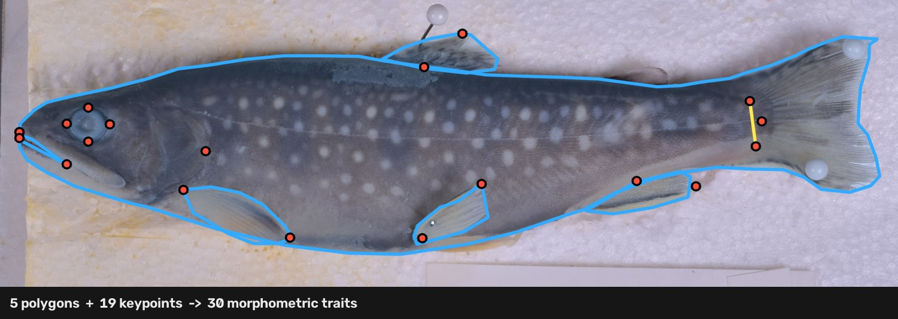

# caliPr

Reproducible morphometrics for museum fish collections. caliPr records landmarks
on specimen photographs and derives 33 morphometric traits, coordinates in TPS
format for geometric morphometrics, and annotated images, from a single stored
annotation per specimen.

It implements the trait schema of MorFishJ (Ghilardi 2022) with Cornell
extensions, and separates measurement from digitisation: landmarks are stored as
coordinates, and every trait, ratio and figure is derived from them. Changing a
trait definition is a re-run rather than a re-digitisation, and the same
coordinates train a model to place them automatically.

Every landmark records who placed it. A bent or tilted specimen is measured along
a midline, as MorFishJ straightens one. The measurement error of every trait
comes from re-labelling a subset blind, reported as ICC and %ME. Each specimen
carries Darwin Core records, so a measurement can be joined back to the
collection's own record.

Standard length agrees with physical caliper measurements to a median of 1.12%
across 35 specimens (see [Accuracy](#accuracy)).



## Installation

```bash
git clone https://github.com/MizuguchiJAkira/caliPr.git
cd caliPr
python3.11 -m venv .venv
./.venv/bin/pip install -e ".[dev]"
```

Python 3.11 or newer. Four dependencies (NumPy, OpenCV, openpyxl, Pillow),
approximately seven seconds. The system Python on macOS is 3.9 and will be
refused.

Automated landmarking (Auto-label) requires PyTorch, DeepLabCut and Segment
Anything, which are installed separately and are not needed for manual labelling
or export, and the trained models, which are downloaded rather than kept in the
repository:

```bash
python3.11 -m venv .venv-train
./.venv-train/bin/pip install "deeplabcut==3.0.1" transformers
./.venv/bin/python scripts/fetch_model.py
```

About 1.7 GB for the environment and 570 MB for the models and Segment Anything.
The models are trained on the Cornell brook trout photo rig (fish facing left, a
ruler along the top, a mirror showing the head) and do not transfer to
photographs taken another way.

Development and all timings reported here are on Apple Silicon (M3, 8 GB) with
PyTorch on the MPS backend. There is no CUDA requirement.

## Usage

```bash
./.venv/bin/python scripts/label_server.py
```

This serves a browser interface at `http://localhost:8765`. Add a folder of
photographs, label specimens, and export. See
[docs/TUTORIAL.md](docs/TUTORIAL.md) for a walkthrough with screenshots.

Command-line equivalents, for scripted use:

```bash
python scripts/export_measurements.py --dataset cornell
python scripts/export_tps.py --sidecars data/cornell/sidecars \
    --images data/cornell/lateral --out results/cornell/tps
python scripts/render_overlays.py --dataset cornell
python scripts/measurement_error.py --dataset cornell
```

A dataset is a directory under `data/` containing `lateral/`, optionally
`frontal/`, `sidecars/`, and a `schema.json` declaring which landmarks the study
collects: which of the master landmarks it leaves out, any it adds for itself,
what it calls them, and — for a study following another protocol — which landmark
scheme it collects instead (`src/fish_morpho/schemes.py`). A study on another
scheme exports coordinates rather than traits: every trait is defined in code
against caliPr's own landmarks. An optional `darwin_core.csv` holds the
specimens' collection records.

## Measurements

Twenty-two traits from the MorFishJ schema and eleven Cornell extensions, derived
from 5 polygons and 23 lateral keypoints. The schema is defined in
`src/fish_morpho/landmark_config.py` and is the single source of truth for the
labeler, the measurement engine and the training pipeline.

Traits requiring a landmark the study does not collect are omitted from the
export rather than left blank.

Three columns of the reference spreadsheet are out of scope: `weight(g)` is a
mass, and `body_width` and `caudal_peduncle_width` are measured across the
specimen, which a lateral photograph cannot show.

### Bent and tilted specimens

MorFishJ measures lengths along the horizontal, so it has the user straighten a
bent fish first. The user traces a line down its midline, and ImageJ's
**Straighten** resamples the photograph across a spline through it. caliPr does
the same geometry to the coordinates instead of the pixels:

- **The same curve.** It fits the natural cubic spline ImageJ fits,
  parameterised by the square root of each segment's length.
- **The same positions.** Each landmark goes where the straightened image would
  put it: its distance along the curve becomes x, and its distance off the
  curve, measured square to it, becomes y.

The photograph and the clicked landmarks are unchanged, and deleting the
midline undoes it. Two points level a straight fish that is only tilted.

Tests check the result against specimens of known shape:

- A tilted fish with a midline measures identically to the level fish on every
  trait.
- A fish bent through 40° recovers its standard length and total length to
  within 1%.

A landmark on the inside of a bend, farther from the curve than the bend's
radius, has no single place on the straightened fish. Such landmarks are reported
rather than placed. The QC sheet records which specimens were straightened and
how far each midline turns (`src/fish_morpho/straighten.py`).

## Outputs

**Workbook** (`.xlsx`), or the Measurements sheet alone as CSV for R. Before
export, a preview shows each trait's missing values, so a column most specimens
lack can be left out, or only complete rows kept, before a PCA drops every row
with an NA.

| sheet | contents |
|---|---|
| About | provenance: dataset, generation time, source commit, unit counts, check counts |
| Measurements | one row per specimen, one column per trait, with a per-row `units` column |
| Ratios | lengths over standard length, areas over SL²; dimensionless |
| Shape | Mosimann log-shape variables; the size correction for between-group comparison |
| QC | calibration method and confidence per view, missing landmarks, who placed them, straightening, data compromises |
| Validation | automated checks, most severe first |
| Specimens | Darwin Core record of each specimen, when the study keeps them |
| MeasurementOrFact | the measurements in Darwin Core's long form: value, unit, who determined it, and the trait's definition |
| Measurement error | ICC and %ME per trait, when a blind re-label round exists |

**Coordinates for R.** Two formats are available:

- **One CSV per specimen**, in ImageJ's Multi-Measure layout (landmark, Label,
  X, Y, in cm or mm), with a landmark key and a script that reads the folder into
  geomorph.
- **A single TPS file**, with a landmark-name file and a loader snippet. Two
  TPS conventions are handled explicitly: y is Cartesian from the bottom left,
  and missing landmarks are written as negative coordinates for
  `readland.tps(..., negNA = TRUE)`.

Either way, `specimens.csv` gives each specimen's group, scale, operators,
straightening and collection records. Straightened coordinates are an option.

```r
library(geomorph)
A <- readland.tps("landmarks.tps", specID = "ID", negNA = TRUE)
dimnames(A)[[1]] <- read.csv("landmark_names.csv")$name
gpa <- gpagen(A)
plot(gm.prcomp(gpa$coords))
```

**Annotations** are stored as one JSON sidecar per specimen, keyed by landmark
name. Each sidecar records who placed each point, and which points the model
suggested and a person corrected or accepted. These are the durable artefact;
all exports are derived from them.

**Overlays**: each photograph with its annotation drawn on.

## Accuracy

Standard length was compared against physical caliper measurements for 35
hand-labelled specimens spanning three hatchery strains: median difference 1.12%,
mean 1.39%, bias +0.69%.

The specimen-to-caliper correspondence was verified rather than assumed. An
offset sweep confirms alignment at offset 0 for two of three strains (1.40% and
1.56% mean error, against 12–20% at any shift). Seven TXD rows differ from their
photographs by 5–32% with mixed sign and no offset accounts for it; standard
length expressed in ruler spans, which requires no millimetre assumption,
supports the photographs. Those rows are listed in
`data/validation/caliper_exclusions.json` and excluded from validation only.

### Calibration

Three modes, all producing px/mm or declaring that none is available.

1. **Tick detection.** `detect_tick_scale()` measures millimetre ticks directly.
   Validated against 20 hand-clicked calibrations across two camera distances:
   mean error 1.0%, maximum 2.5%. C-Thru rulers carry both metric and imperial
   scales and 1/16 in = 1.5875 mm, so the strongest autocorrelation peak selects
   the imperial period and inflates every trait by approximately 59%; the
   detector takes the smallest period on which several frequency bands agree.
2. **Two points and a known span.** A mistyped span is self-consistent and
   undetectable downstream, so the labeler reports px/mm live and flags
   deviation from the collection lot's median.
3. **No scale.** Measurements are reported in pixels and marked as such. The
   Ratios and Shape sheets remain valid, being dimensionless.

Tick detection locates a ruler in 180 of 181 alewife photographs, but only 9 of
27 collection lots are internally consistent to within 25%. Detection rate and
accuracy are separate quantities.

### Measurement error

A subset of labelled specimens is labelled again blind. The subset is drawn
across the study's groups, and each fish gets a code, in random order, in a
separate study folder. None of the original landmarks are there to see, and
automated landmarking is refused. Both labellings go through the same pipeline,
and for each trait the workbook reports:

- **%ME**, the share of variance that is measurement error: 100 × s²within /
  (s²within + s²among), from a one-way ANOVA with specimen as the factor (Bailey
  & Byrnes 1990; Yezerinac et al. 1992).
- **ICC(1)** with an F-based 95% interval. It equals 1 − %ME/100.
- **ICC(3,1)**, which sets aside a constant shift between the two labellings
  (Shrout & Fleiss 1979).
- **The bias** between labellings.
- **The technical error of measurement**, in the trait's units.

Repeat rounds on the same specimens, by a second operator or later by the same
one, are analysed together. The statistics reproduce Shrout & Fleiss's worked
example exactly (`src/fish_morpho/repeatability.py`).

### Validation

Eight checks run before the workbook is written: `orientation`,
`landmark_in_frame`, `landmark_off_body`, `duplicate_id`, `mixed_units`,
`calibration_outlier`, `shape_outlier`, `incomplete`. Each targets a failure mode
that produces plausible values rather than an error.

Thresholds are conventional rather than fitted: robust z of 3.5 on a median/MAD
scale, and 25% calibration drift. Across the 60 sidecars in both datasets the
current pass returns no errors, five shape-outlier warnings, and incomplete
notes consistent with labelling in progress.

## Datasets

|  | brook trout (`cornell`) | alewife (`alewife`) |
|---|---|---|
| species | *Salvelinus fontinalis* | *Alosa pseudoharengus* |
| question | body-shape differences among three hatchery strains | proportional differences between landlocked and migratory populations |
| photographs | 131 | 30, from four CUMV lots, 1947–1953 |
| labelled | 131 lateral, 130 frontal | not yet |
| collects | caliPr landmarks: 5 polygons, 19 keypoints | BGNN 2D landmarks |
| scale reference | ruler on the tray | ruler on the tank glass |

Photographs are not included in the repository. Sidecars are.

Population assignment for the alewife lots has not been made; no comparison is
meaningful until it is. That study excludes the pelvic and anal fin outlines,
where fin-to-body contrast and fraying prevent reliable tracing.

## Limitations

**Fin traits reflect preservation state.** Restricting to fins traced at 8 or
more vertices, size-corrected variability is 60.1% for dorsal fin area and 42.7%
for pelvic, against 5.4% for body area on the same photographs. Alcohol
preservation dries fins so that extension depends on how the specimen dried and
was pinned. Seven traits are affected (DFh, AFh, PlFl, DFs, PlFs, AFs, and to a
lesser extent PFs) and should not carry a between-group comparison alone.

**Tracing density is imprecise but not directionally biased.** Subsampling a
dense body outline loses area monotonically (−26% at 5 vertices, −2% at 24), but
re-tracing one specimen at 46–86 vertices per fin changed areas by +27.1%, +1.3%,
−3.1% and −7.8% across the four fins. `FIN_POLYGON_TARGET_VERTICES` is 16 because
errors of that size in either direction cannot be corrected afterwards.

**Measurement repeatability has not yet been measured for these datasets.** The
tool for it is built (see [Measurement error](#measurement-error)), but no blind
re-label round has been run, so the operator's contribution to any between-group
difference is not yet known.

**Declared compromises.** A clipped fin or snout is flagged in the labeler,
which records the affected traits; the pipeline sets those to NaN with the reason
carried onto the QC sheet.

## Automated landmarking

Under development and not required to use the pipeline. See
[docs/automation.md](docs/automation.md) for the full evaluation.

Current state: median held-out keypoint error 0.81 mm across 9 specimens, against
a manual pipeline that agrees with calipers to approximately 1.4 mm. Thirteen of
nineteen landmarks are under 1 mm; `dorsal_tip` (2.10 mm) and
`peduncle_narrowest_ventral` (2.01 mm) are not. The model does not transfer
across orders: on alewife it returns a median likelihood of 0.28 with every point
below the 0.6 threshold.

Segment Anything produces the body outline at IoU 0.937 against dense hand
tracings. It follows the dorsal and adipose fins rather than crossing their
bases; correcting this requires the four fin-base endpoint landmarks, which are
in the schema but not in the trained model.

Predicted landmarks are checked against where each one falls on the fish's own
body, as a fraction of the span from snout to caudal tip, measured from the
dataset's hand labels by `scripts/fit_plausibility.py`. A landmark outside the
range every labelled specimen occupies is withheld rather than placed, with the
reason given. This catches errors confidence does not: one prediction placed a
dorsal fin base half a fin out of position at 0.914 likelihood. Against the hand
labels the check rejects 0.7% of correct landmarks (4 of 553, leave-one-out). A
dataset without fitted bands is not checked, which is the correct default for a
taxon whose proportions have not been measured.

Accuracy is bounded by labelling coverage rather than by the model. The head and
peduncle landmarks carry 46 labelled examples each and predict to 0.002-0.008 of
standard length; every fin landmark carries six or seven, and those are the ones
that fail.

Predictions are marked `source: predicted` and are refused by
`build_dlc_dataset.py`. Saved sidecars record which points a human corrected,
which were confirmed, and which were left unreviewed; these are not equivalent
evidence and are not pooled.

## Repository layout

```
src/fish_morpho/     schema, measurement engine, calibration, validation, export
scripts/             labeler, exporters, preprocessing, model training and evaluation
data/<dataset>/      lateral/, frontal/, sidecars/, schema.json
docs/                tutorial, automation reference, methods ledger
tests/               401 tests
```

`docs/what-we-tried.md` records approaches that were tested and rejected, with
the measurements that rejected them.

## Status

The manual pipeline is in use. Sidecar JSON in, validated workbook and TPS out,
33 traits covering all 22 photo-measurable columns of the reference spreadsheet.

Fin outlines are being re-traced at the 16-vertex target; 74 of 131 brook trout
are complete. Until a specimen is redone its fin-derived traits export as blank
with the reason attached.

Automated landmarking is used on the brook trout as a starting point: each
sidecar records which predicted points a person corrected, accepted or left
unreviewed (19 of 131 fish still have some unreviewed). It does not transfer to
other taxa.

Priorities, in order:

1. Run a blind re-label round on the brook trout.
2. Assign the alewife lots to populations.
3. Complete the fin re-tracing.
4. Label the four fin-base endpoints and retrain.

## Citation

caliPr is in preparation for publication. A Zenodo DOI will be given here on
release; until then cite this repository and the commit recorded on the About
sheet of the workbook.

Please also cite the trait schema:

> Ghilardi, M. (2022). *MorFishJ: A software package for fish traditional
> morphometrics.* Zenodo.
> doi:[10.5281/zenodo.6969273](https://doi.org/10.5281/zenodo.6969273)

## License

MIT; see [LICENSE](LICENSE). The licence covers the code and the annotation
schema. The specimens and photographs belong to the Cornell University Museum of
Vertebrates. No MorFishJ source is included; the trait definitions are
reimplemented from its published documentation. The straightening reimplements
the geometry of ImageJ's Straighten command, which is in the public domain.

## Acknowledgements

Built for the ichthyology collection of the Cornell University Museum of
Vertebrates. Automated landmarking builds on DeepLabCut and Segment Anything.
