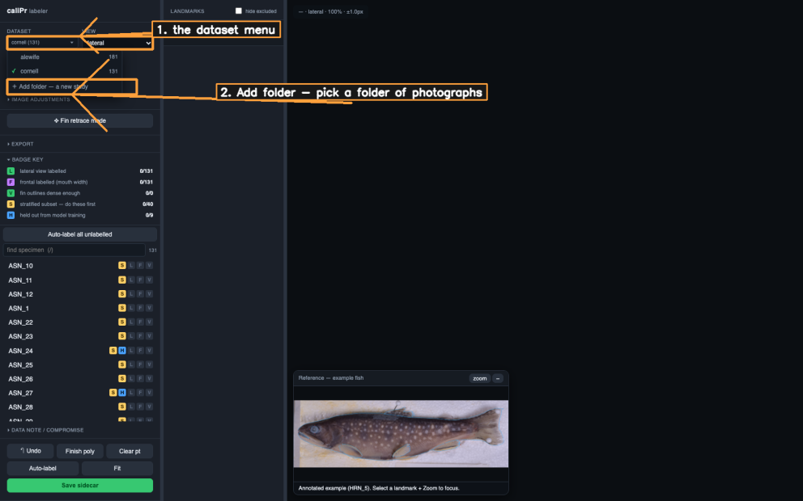
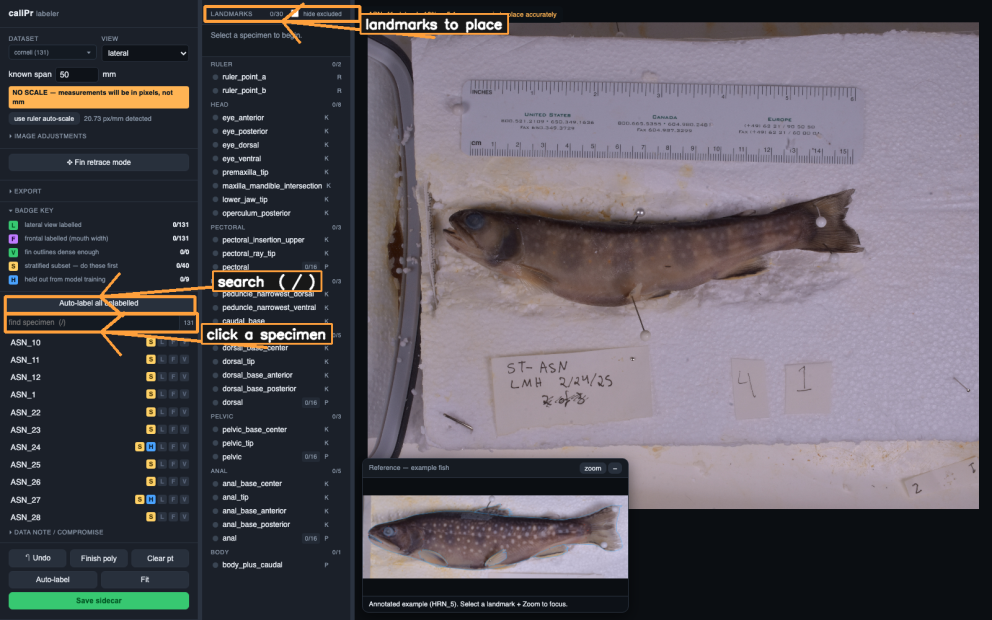
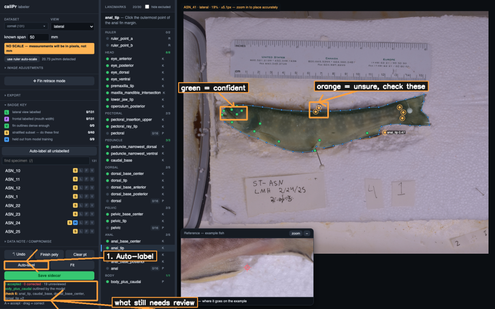
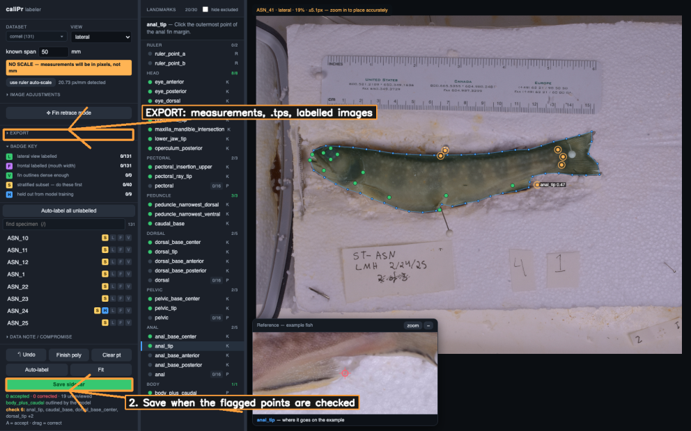

# Tutorial

Getting from a folder of photographs to a spreadsheet of measurements. No
terminal beyond the two lines below, and nothing to configure.

```bash
git clone https://github.com/MizuguchiJAkira/caliPr.git
cd caliPr
python3.11 -m venv .venv          # 3.11 or newer
./.venv/bin/pip install -e .
./.venv/bin/python scripts/label_server.py
```

Open <http://localhost:8765>. Everything after this happens in the browser.

Four packages come down — NumPy, OpenCV, openpyxl, Pillow — and it takes about
ten seconds. **Check your Python first:** macOS still ships 3.9, which is too
old, and `pip install` will refuse with a `requires-python` error rather than
anything more helpful. `python3 --version` tells you; Homebrew or python.org
gets you a newer one.

Automated landmarking is a separate, much heavier install (PyTorch, DeepLabCut,
Segment Anything) and is **not needed to label by hand or to export**. Skip it
until you want it:

```bash
python3.11 -m venv .venv-train
./.venv-train/bin/pip install "deeplabcut[tf]" transformers torch
```

Without it the labeler runs normally and the Auto-label button says so.

---

## 1. Add your photographs

Open the **dataset** menu and choose **Add folder**, then pick a folder of
photographs. It becomes a *study*, named after the folder.



You can also drag a folder straight onto the page. Subfolders are walked, and
their names are kept: `Lake_2026/Site_A/IMG_01.jpg` arrives as
`Site_A_IMG_01.jpg`, so a folder-per-site survives into the filenames. Anything
that is not an image is ignored.

To add more later, hover a study in the same menu and click **+ photos**.

A study is a plain folder under `data/`, so you can also just make one yourself
and it will appear without restarting the server.

---

## 2. The three columns

Controls on the left, the landmarks to place in the middle, the specimen list
below the controls. Click a specimen to open it.



`/` focuses the search box. It matches catalogue numbers as you type, and also
takes words like `todo`, `labelled`, `heldout`. Terms combine, so `todo txd`
gives the TXD specimens still to do.

---

## 3. Auto-label, then check what it flags

**Auto-label** runs the trained model on the open specimen.



Points arrive coloured by the model's own confidence:

| | |
|---|---|
| **green** | confident |
| **orange, ringed** | not confident — these are the ones to look at |

It also draws the body outline. Selection jumps straight to the least
trustworthy point, and the sidebar lists what still needs review.

Then, for each point:

- **drag it** to correct it. A faint line stays behind showing where the model
  had it, so you can see the size of the fix.
- **press `A`** to accept it, meaning you looked and agree.

Accepting is a deliberate keypress, never assumed from leaving a point alone.
Those are different claims and the sidecar records them separately.

The first Auto-label of a session takes a few seconds while the model loads;
after that it is about a second. **Auto-label all unlabelled** runs the whole
backlog in one pass and caches the results, so reviewing them afterwards is
instant.

---

## 4. Save, and export



**Save sidecar** writes one JSON file per specimen into `sidecars/`. That file
is the durable artefact — every export is derived from it, and it records which
points you corrected and which you accepted.

If every landmark is still exactly where the model put it, Save asks first. A
sidecar saved that way is model output entering the training set as ground
truth, which is worth one deliberate click to avoid.

Open **EXPORT** for three things:

| | |
|---|---|
| **Measurements (.xlsx)** | one row per specimen, 33 traits, plus About / Ratios / Shape / QC / Validation sheets |
| **Landmarks for R (.tps)** | geomorph-ready, with landmark names and a loader snippet |
| **Labelled images (.zip)** | each photograph with its annotation drawn on |

Read the **Validation** sheet before analysing. It lists the checks that failed,
most severe first.

---

## What to expect from the automation

It is a starting point, not finished work.

- The head, jaws, operculum, pectoral and peduncle landmarks are usually right.
- **Fin tips are often wrong**, especially on specimens whose fins dried folded
  flat — and the model flags those itself, which is why the orange points are
  worth more attention than the green ones.
- The body outline follows the dorsal and anal fins instead of crossing their
  bases. Drag those vertices onto the body wall.
- On a species the model was not trained on, expect *everything* to come back
  orange. That is the correct answer, not a failure.

Accuracy figures and their caveats are in the [README](../README.md).

---

## No scale?

If there is no ruler in the frame, the labeler says so and measurements come out
in **pixels**, marked as such in a `units` column. That is a valid way to work:
the Ratios and Shape sheets are dimensionless, so a study comparing proportions
does not need millimetres.

With a ruler, click **use ruler auto-scale**, or place the two ruler points and
type the span you clicked across.

---

## Sharing the work

For a collaborator without Python:

```bash
python scripts/build_standalone_labeler.py --out calipr-labeler.html
```

One self-contained HTML file. They open it, label, and send back a bundle
containing their photographs and labels; `scripts/import_standalone_labels.py`
folds it in and verifies the photographs are the ones that were labelled.
